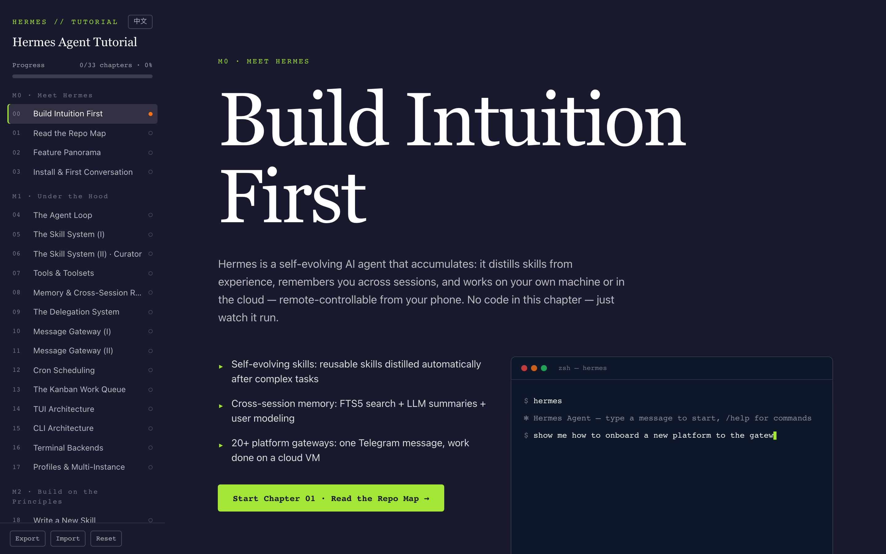
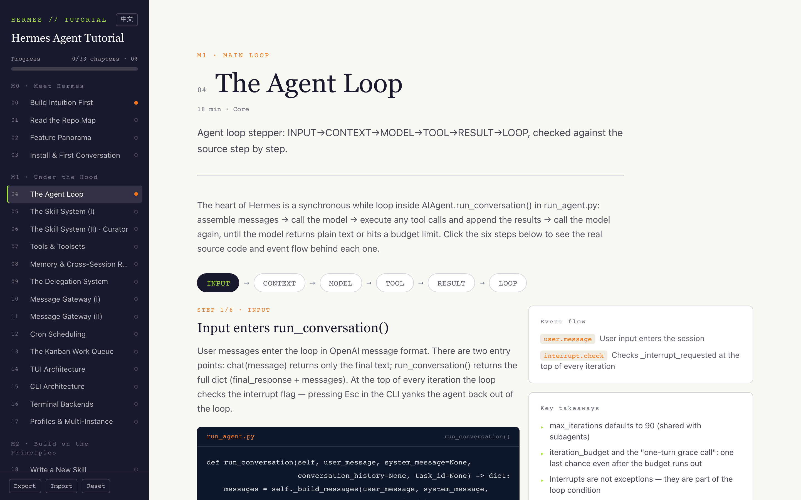

# Hermes Agent Tutorial

[中文](README.ch.md) | **English**

[](https://github.com/g1429566/hermes-tutorial/actions/workflows/ci.yml)


An **interactive tutorial site** built around [Hermes Agent](https://github.com/NousResearch/hermes-agent): a single-page immersive app, statically exported, backend-free, and fully offline-capable. Defaults to English; 中文 available via the in-site language switcher.

**Live site: https://g1429566.github.io/hermes-tutorial/**

## Screenshots

| Home (M0 · Build Intuition First)       | Interactive lab (M1 · The Agent Loop)             |
| --------------------------------------- | ------------------------------------------------- |
|  |  |

## Overview

Using Hermes itself as the teaching subject, the tutorial walks learners through 33 progressive chapters:

1. **Meet** Hermes and its capabilities (M0 Meet Hermes);
2. Go **under the hood** of how it works (M1, 14 chapters mapped to real source code);
3. **Design new agents and extend agent functionality** on those principles (M2 Build on the Principles);
4. Reach **interview readiness for AI agent engineering roles** (M3 Interview Sprint + M4 Extensions & Frontiers).

Each chapter = kicker + explanation + interactive lab + key takeaways + completion button. Chapter 19 embeds a Pyodide (CPython WebAssembly) sandbox so you can run Python right in the browser.

## Course Structure

| Module | Topic                   | Chapters |
| ------ | ----------------------- | -------- |
| M0     | Meet Hermes             | 4        |
| M1     | Under the Hood          | 14       |
| M2     | Build on the Principles | 5        |
| M3     | Interview Sprint        | 4        |
| M4     | Extensions & Frontiers  | 2        |
| M5     | Agent Core Completion   | 4        |

M5 covers context compression & checkpoints, model routing & credential pools, multimodal tools, and batch runs & evaluation.

## Features

- Bilingual UI and content (中文 / English), switchable in the nav sidebar and persisted locally
- 33 interactive labs — one hands-on component per chapter
- Progress stored in `localStorage`: versioned keys, export / import / v1 migration / reset
- Hash routing — deploy the static export to any static file server
- Pyodide runtime vendored from npm into `public/pyodide/` by `postinstall`, fully offline
- Vitest unit tests + ESLint + Prettier + GitHub Actions CI

## Quick Start

Requires Node.js ≥ 20.9.

### Development (hot reload)

```bash
npm install
npm run dev
```

### Production (static export + local static server)

```bash
npm run build   # outputs out/
npm run start   # http://localhost:3000
```

### Docker one-liner (nginx)

```bash
docker compose up --build
```

Then visit http://localhost:8080 .

## Tech Stack

Next.js 16 (static export) + React 19 + Tailwind CSS 4 + TypeScript 6. Content is embedded as typed TypeScript data structures (`src/data/`), not MDX.

## Project Structure

```
app/               # Next.js App Router entry (layout / page / globals.css)
src/
  components/      # CourseNav / ChapterRenderer / Quiz / labs/ per-chapter interactive labs
  data/            # 33-chapter metadata + per-chapter content data (typed TS, zh + en exports)
  hooks/           # useChapter (hash routing) / useProgress (progress subscription)
  lib/             # i18n, progress v1/v2, assessment, cron-explain, judge, skill-validate
scripts/           # serve.mjs (static server) / setup-pyodide.mjs (vendor Pyodide)
tests/             # Vitest unit tests
```

## License

[MIT](LICENSE)
